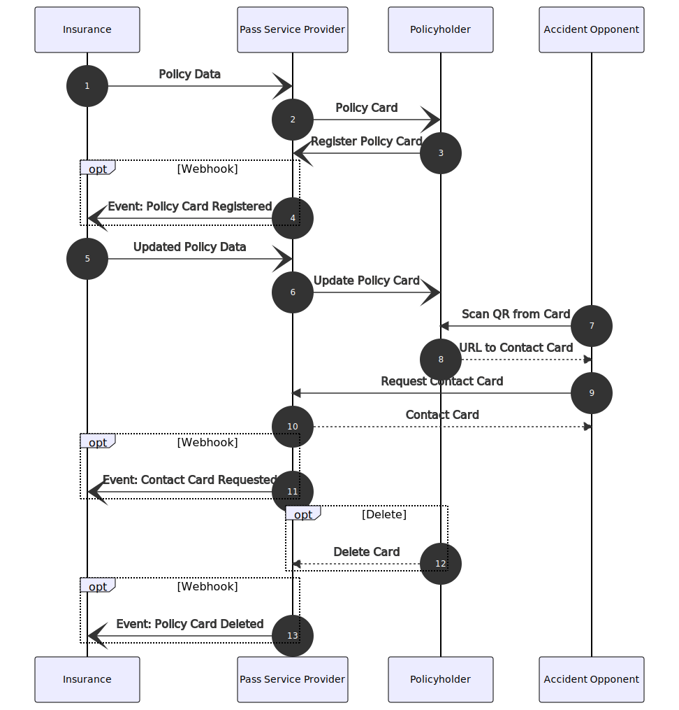

Die FRIDA Car Claims API ermöglichen es Nutzer:innen die wichtigsten Policendaten auf jedem Smartphone einfach und sicher per Wallet abzuspeichern.
Im Schadenfall können so die wichtigsten Versicherungsdaten mit wenigen Klicks aufgerufen und ein standardisierter, volldigitaler Schadenprozess angestoßen werden.

Mit der FRIDA Car Claims API sprechen alle Versicherer die gleiche Sprache.
Sowohl Versicherungsunternehmen, als auch Drittanbietern wird es vereinfacht Policendaten in digitale Wallets zu überführen und stets aktuell zu halten.x

